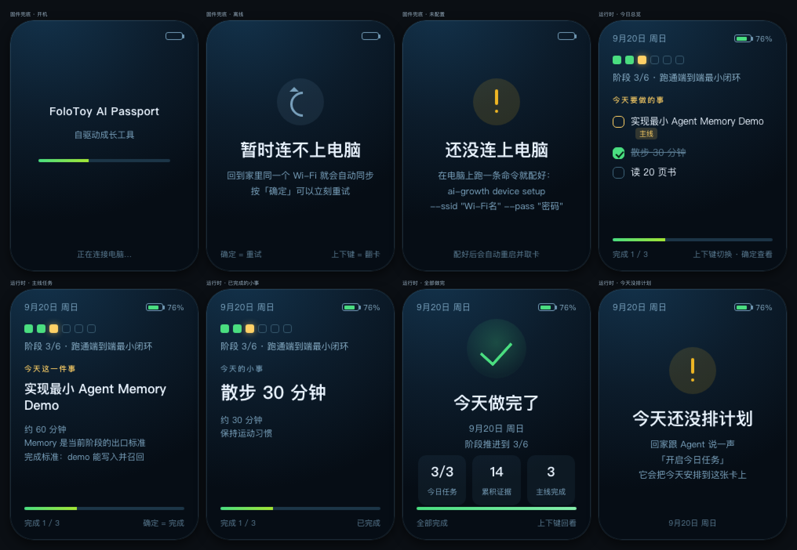

# AI Growth

> **让 Agent 陪你成长。** 你说想成为什么样的人，Agent 把路铺到今天 —— 你每天只需要做今天这一件事。

[](https://www.npmjs.com/package/ai-growth)
[](./LICENSE)
[](https://nodejs.org)

> 第一次使用？看 [START-HERE.md](./START-HERE.md)（3 步开始 + 该对 Agent 说什么）。
> **Agent 请读 [AGENTS.md](./AGENTS.md)** —— 那是给 AI 的主入口，本文是给人看的。

## 它是什么

`ai-growth` 是一个跑在**你自己电脑上**的个人成长系统。它把「目标 → 阶段 → 今天做什么」这条线交给 Agent 维护，把「目标是什么、要不要继续」留给你。

每天只给你 **1 件主线任务 + 0~2 件小事**；**昨天没做完的第二天自动过期**，不会攒成债务。你不需要自己排期、复盘、把任务搬到明天 —— 那些是 Agent 的事。

| 它是 | 它不是 |
|---|---|
| 让 **Agent 帮你维护成长计划** 的系统 | 又一个待办清单（排期和搬运都不归你管） |
| 每天**只面对今天**的执行界面 | 打卡 App（没有连续天数、没有断签焦虑） |
| 用**可核对的事实**表达进度（`Stage 3 / 6`、证据条目） | 游戏化 RPG（**没有**属性值、等级、掌握度百分比、自律分） |
| **本地优先**：数据在自己机器上，不需要账号 | 云服务（不注册、不上传，离线也能跑） |

## 3 分钟开始

```bash
npm install -g ai-growth     # 1. 安装
ai-growth init               # 2. 初始化本地数据（数据在 ~/.ai-growth）
ai-growth mcp-config         # 3. 打印 MCP 配置 → 粘进你的 Agent 并信任它
```

然后把 [`SKILL.md`](./SKILL.md) 交给 Agent 当行为准则，对它说一句：

> **「开始今天的学习」** 或 **「今天要做什么」**

第一次它会先**访谈你**（想成为什么样的人、为什么），再排出第一份今日计划。
**在你表态之前，它不会派任何任务** —— 这是写进代码的硬规则，不是"建议"。

## 它怎么工作

```
你说想法 → Agent 访谈 → 方向 → 目标 → 阶段计划 → 今日计划 → 今日任务
                                                              ↓
       下一次对话 ← 记忆 ← 成长事件 ← 复盘 ← 证据 ← 完成 / 过期
```

三条**不可协商**的规则（写在代码与测试里，不只写在文档里）：

1. **AI 管路线，人决定目的地。** 它不替你决定人生方向。
2. **每天只推今天。** 每日任务次日必定过期，绝不顺延成跨天债务。
3. **不编数值。** 进度只用可核对的事实表达；任何"属性值 / 掌握度 % / 自律分 / 等级"都会被测试拦下。

## 你会看到什么

- **面板**：`http://localhost:4580`，网页形态，也可以当桌面组件（`?layout=widget`）
- **对话**：平时你就是在 Agent 里说一句话，不必打开面板
- **可选的小屏**：把今天推给 AI Passport 设备，做完按一下，卡片立刻变成完成态



<sub>图为设备端「今日任务卡」的全部卡面，与运行时同一套模板渲染。</sub>

## 常见问题

| 问题 | 回答 |
|---|---|
| 我的数据在哪？ | `~/.ai-growth/growth.db`（本地 SQLite）。代码包与数据完全分离，更新不影响数据 |
| 需要注册账号吗？ | **不需要**。没有账号体系，也没有任何上传；服务只监听本机 |
| 一定要用 MCP 吗？ | 不一定。Agent 不支持 MCP 时可用 CLI（`ai-growth status/today/complete`，全部支持 `--json`） |
| 会不会给我打自律分？ | 不会。这是硬规则，见上文第 3 条 |
| 怎么卸载？ | 见 [安装与使用](./docs/usage.md) 里的「卸载 / 重置」 |

## 给 Agent

**Agent 请读 [`AGENTS.md`](./AGENTS.md)**（主入口）；行为准则是 [`SKILL.md`](./SKILL.md)；精简索引是 [`llms.txt`](./llms.txt)。

## 进一步阅读

| 文档 | 内容 |
|---|---|
| [`START-HERE.md`](./START-HERE.md) | 第一次使用：3 步 + 该对 Agent 说什么 |
| [`docs/usage.md`](./docs/usage.md) | 安装与使用细节：接入 Agent、面板与桌面组件、设备、数据位置、卸载、故障排查 |
| [`docs/agent.md`](./docs/agent.md) | 给 Agent / 自动化：自动发现清单与 CLI 参考 |
| [`docs/development.md`](./docs/development.md) | 开发、架构约定、当前限制、参与贡献 |
| [`PRODUCT_SPEC.md`](./PRODUCT_SPEC.md) | 完整产品规范（想知道"为什么这么设计"） |

## 许可

[MIT](./LICENSE) © 2026 lairey-ai
